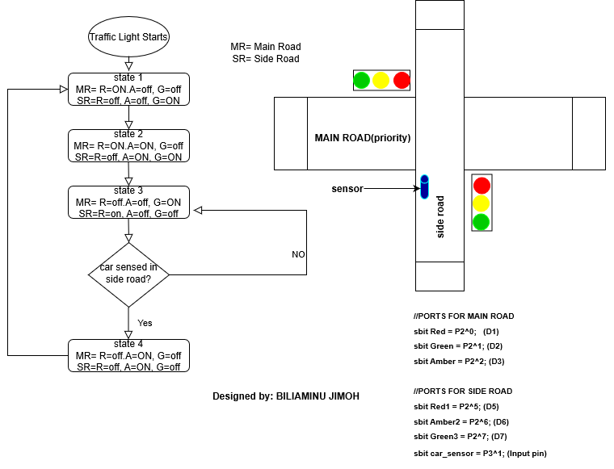

<head>
      TRAFFIC LIGHT DESIGN USING A SIMPLE EMBEDDED OPERATING SYSTEM
</head>
 
 
 
 
 
 
This is a traffic light code using interrupt to define the function of a basic simple embedded operating system for an STC89C52 Microcontroller.
The basic simple embedded operating system help to adopt an object oriented approach of coding in C. The car_sensor defined in the Port.h is a switch which is used to simulate a sensor sensing car presence at the side-road. The traffic light runs normally but stays on green to give priority to cars on the main road. Find below the picture of the microcontoller board used for experimentation:

When car is sensed on the side-road, the traffic light sequence remain for some seconds while giving priority to the main road cars but 
soon change to amber and then green on the side-road for allloted minutes before returning priority to the main road. When car is again sensed on the side  road, it switch back to it but after a minimum time of passage of car is reached on the main road. This is implemented by the expression if ((++Time_in_state >= GREEN_DURATION)& (car_sensor == ON)) in traffic_light.c  file.

Here is the Implementation on board:

     
      

